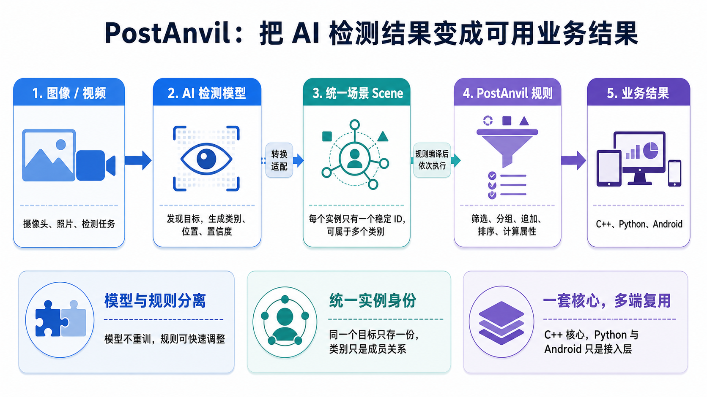

# PostAnvil

PostAnvil 是一个面向目标检测结果的轻量级规则引擎。检测模型负责发现目标，PostAnvil
负责按照业务规则对目标进行筛选、分组、追加、排序和属性计算，再把结果交给应用程序。



## 项目特点

- **模型与规则分离**：调整业务判断不需要重新训练模型或修改宿主程序。
- **统一实例身份**：每个目标只有一个稳定 ID，同一实例可以属于多个类别而不会被复制。
- **规则先编译再执行**：规则错误会在处理数据前报告，编译结果可以重复用于多个场景。
- **一套核心多端复用**：C++20 核心同时服务 C++、Python 和 Android。
- **面向视觉后处理**：直接提供类别、检测框、置信度、空间关系和排序等常用能力。

## 快速导航

| 我想做什么 | 从这里开始 |
|---|---|
| 了解项目和文档结构 | [文档中心](docs/README.md) |
| 第一次编写 PostAnvil 规则 | [DSL 快速开始](docs/dsl/README.md) |
| 查找规则、类型和内置函数 | [DSL 参考手册](docs/dsl/reference.md) |
| 在 C++ 项目中使用 | [C++ 接入](docs/integration/cpp.md) |
| 在 Python 中使用 | [Python 接入](docs/integration/python.md) |
| 接入 Ultralytics YOLO | [Python 接入：Ultralytics YOLO](docs/integration/python.md#ultralytics-yolo-集成) |
| 在 Android 中使用 | [Android 接入](docs/integration/android.md) |
| 编译项目或生成原生包 | [原生项目构建](docs/development/building.md) |
| 构建和发布 Python wheel | [Python 包构建与发布](docs/development/python-package.md) |
| 了解实例 ID 与类别设计 | [实例身份与类别成员设计](docs/design/instance-identity.md) |
| 查看后续优化计划 | [开发路线图](docs/development/roadmap.md) |

## 最小示例

下面的规则只保留 `person` 类别中置信度不低于 `0.5` 的实例：

```postanvil
RULE FILTER "person" {
	self.conf >= 0.5
}
```

Python 中可以这样执行：

```python
import postanvil

program = postanvil.compile('''
RULE FILTER "person" {
    self.conf >= 0.5
}
''')

scene = postanvil.Scene(postanvil.Image(640, 480))
scene.add("person", postanvil.Instance(10, 20, 80, 120, 0.90))
scene.add("person", postanvil.Instance(30, 40, 60, 100, 0.40))

result = program.evaluate(scene)
assert result.count("PERSON") == 1
```

完整语法和执行顺序请继续阅读 [DSL 快速开始](docs/dsl/README.md)。

## 使用方式

PostAnvil 提供三种公开接入方式：

- **C++**：通过 `PostAnvil::static` 或 `PostAnvil::shared` 链接核心库；
- **Python**：安装 wheel 后使用 `postanvil`，Ultralytics 为可选依赖；
- **Android**：可以直接使用 `.a/.so + include`，也可以通过 JNI 从 Java/Kotlin 调用。

构建方式、依赖和平台差异不在本页，请进入对应分册：

- [原生项目构建](docs/development/building.md)
- [Python 包构建与发布](docs/development/python-package.md)
- [Android 接入与双 ABI 构建](docs/integration/android.md)

## 当前状态

当前版本为 **0.8.x**，DSL 正处于快速迭代期，不保证未来版本兼容旧语法。公开行为以
发布版本的文档、公开头文件、Python 绑定和测试结果为准。

## 完整文档

所有文档均由 [文档中心](docs/README.md) 统一组织。每个分册顶部和底部都提供返回入口
及相邻文档链接，适合按顺序阅读，也可以按具体任务直接跳转。

## 作者注

起因是我在实际YOLO项目中在 python 环境下实现了一套后处理流程，但后来面临后处理逻辑迁移和频繁更改的问题，
于是逐步构思将其抽象为一个独立的规则引擎，希望对业务逻辑的实现和维护有所帮助。

当前项目为个人初学者开发，部分设计和实现可能不够严谨且缺乏经验，欢迎提出意见和建议。

